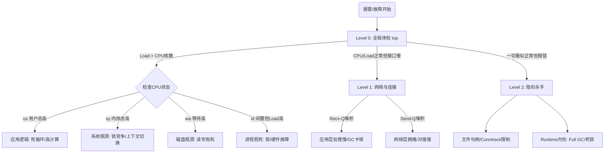

线上故障发生时，最怕的不是没有工具，而是没有路径。命令敲了一堆却没有形成判断闭环，最后很容易在错误方向上浪费时间。本文给出一套可复用的排查决策图：先用 1 分钟完成全局体检，再基于指标进入对应分支，最后检查那些最容易被忽略的“隐形杀手”。

## 🗺 1. 核心排查决策图 (The Decision Map)

*在操作前，请先在脑海中建立此路径，避免乱敲命令。*



---

## 🚑 2. Level 0: 快速体检 (黄金 1 分钟)

**目的：** 确认是 CPU、IO 还是内存炸了。  
**命令：** `top`（按 `1` 展开 CPU 核心）

| 关注指标 | 阈值参考 | 含义 | 下一步跳转 |
| -- | -- | -- | -- |
| **Load Average** | `> CPU 核数 * 0.7` | 系统过载，任务排队中 | 查 CPU 详情 |
| **%us (User)** | `> 70%` | 用户进程在疯狂计算 | 跳转 `3.1 应用逻辑问题` |
| **%sy (System)** | `> 30%` | 内核忙于调度或管理 | 跳转 `3.2 系统争用问题` |
| **%wa (IO Wait)** | `> 30%` | CPU 在等待磁盘 | 跳转 `3.3 磁盘 IO 问题` |
| **Mem/Swap** | `Swap Used > 0` | 内存不足，发生交换 | 跳转 `3.5 内存问题` |

---

## 🔍 3. Level 1: 深度定位（对症下药）

### 3.1 场景 A: 应用逻辑高负载 (`us` 高)

- **特征：** 程序在做高频计算、正则匹配、序列化或死循环。
- **排查步骤：**
1. **定位进程：** `top` 界面按 `P`（大写），记录榜首 `PID`。
2. **定位线程：** `top -H -p <PID>`，找到最耗 CPU 的线程 ID（`TID`）。
3. **定位代码（Java/Go）：**
   - **Java:** `jstack <PID> | grep -A 20 <TID的16进制>`
   - **Go:** `go tool pprof`
   - **其他:** `perf top -p <PID>`

### 3.2 场景 B: 系统争用 (`sy` 高)

- **特征：** 锁竞争激烈、线程频繁创建销毁、上下文切换风暴。
- **排查步骤：**
1. **看切换次数：** `vmstat 1`。如果 `cs`（Context Switch）`> 100k/s`，系统处于极度消耗中。
2. **找元凶：** `pidstat -w 1`（查看 `cswch/s` 最高者）。

### 3.3 场景 C: 磁盘 IO 瓶颈 (`wa` 高)

- **特征：** 磁盘读写慢，拖累系统。
- **排查步骤：**
1. **确认设备：** `iostat -d -x -k 1`。关注 `%util`（接近 100% 即饱和）和 `await`（响应时间，SSD `> 5ms` 需警惕）。
2. **找读写大户：**
   - `iotop -o -P`
   - （无 iotop 时）`pidstat -d 1`

### 3.4 场景 D: 网络/接口响应慢

- **特征：** CPU/IO 都不高，但请求超时。这是最复杂的场景。
- **排查步骤：**
1. **看流量水位：** `sar -n DEV 1`。确认网卡带宽是否打满。
2. **看连接队列（黄金标准）：** `ss -nt`
   - **`Recv-Q` 堆积：应用之过。** 应用处理不过来，数据积压在内核。查代码、查 GC、查锁。
   - **`Send-Q` 堆积：网络之过。** 网络拥堵或客户端接收太慢。查链路（`mtr`）、查客户端。
3. **看连接数：** `ss -s`。关注 `TIME-WAIT` 是否过高（端口耗尽）。

### 3.5 场景 E: 内存与 Swap

- **特征：** 服务间歇性卡顿，或者直接 OOM（Out of Memory）。
- **排查步骤：**
1. **看交换：** `vmstat 1`。重点观察 `si` 和 `so`。只要这两个数持续大于 0，说明内存不够用，系统在读写硬盘当内存，性能会明显下降。
2. **看泄露：** `top` 按 `M` 排序。

---

## 👻 4. Level 2: 隐形杀手排查（高阶必看）

*当上述硬件资源都正常，但系统依然不可用时，请检查以下软限制和内伤。*

### 4.1 操作系统软限制 (Limits)

很多故障是因为到达了 OS 设定的保护上限。

- **文件句柄（Open Files）：**
  - 检查：`cat /proc/sys/fs/file-nr`（已用 vs 上限）或应用日志报错 `Too many open files`。
  - 解决：调整 `ulimit -n`。
- **连接跟踪表（Conntrack）：**
  - 现象：新连接连不上，但没有应用日志，只有内核静默丢包。
  - 检查：`dmesg | grep conntrack` 或查看 `/proc/sys/net/netfilter/nf_conntrack_count`。

### 4.2 运行时内伤 (Runtime Health)

操作系统健康不等于应用程序健康。

- **GC 卡顿（Java/Flink）：**
  - 检查：`jstat -gcutil <PID> 1000`。
  - 判断：`FGC` 频率极高或 `FGCT` 时间过长，导致 STW（Stop The World）。
- **死锁/线程池耗尽：**
  - 检查：应用日志中是否有 `Thread pool exhausted`，或请求一直在等待。

### 4.3 历史回溯 (History)

如果现在系统正常，但刚才卡了一下，用 `sar` 复盘。

- **命令：** `sar -u`（CPU）、`sar -r`（内存）、`sar -n DEV`（网络）  
  再加 `-f /var/log/sa/saXX` 查看当天历史记录。

---

## 🛠 5. 应急与受限环境 (BusyBox/容器)

*当没有 `iotop`、`pidstat`、`mpstat` 时，使用以下内置工具替代。*

- **替代 `iostat`：** 使用 `vmstat 1`，关注 `bi/bo`（块读写）和 CPU `wa`。
- **替代 `netstat`：** 使用 `cat /proc/net/tcp`（硬核）或 `ip link`。
- **替代 `lsof`：** 使用 `ls -l /proc/<PID>/fd`。
- **查看系统报错：** `dmesg | tail`（内核最后的呼救，一定要看）。

---

## 📝 附录：一键巡检命令清单（Copy-Paste）

*遇到故障，直接复制这组命令执行，截图保存现场。*

```bash
echo "=== 1. Load & CPU ==="
top -b -n 1 | head -n 10

echo -e "\n=== 2. Memory ==="
free -h

echo -e "\n=== 3. IO & Context Switch ==="
vmstat 1 5

echo -e "\n=== 4. Disk Activity ==="
# 如果有 iostat
iostat -d -x -k 1 2 || echo "iostat not found"

echo -e "\n=== 5. Network Queues (App Lag vs Net Lag) ==="
ss -nt | grep ESTAB | head -n 10

echo -e "\n=== 6. Kernel Errors (OOM/Hardware) ==="
dmesg -T | tail -n 10
```

---

### 💡 架构师寄语

> 不要迷信工具，要相信逻辑。  
> CPU 跑满查代码，Recv-Q 满查应用；  
> IO 跑满查磁盘，Send-Q 满查网络；  
> 资源都闲还卡顿，去查 Lock、Limits 和 GC。
